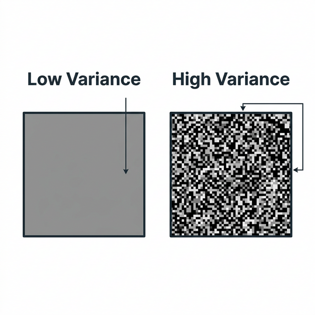
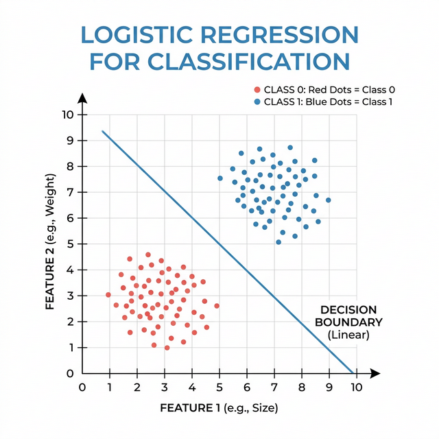
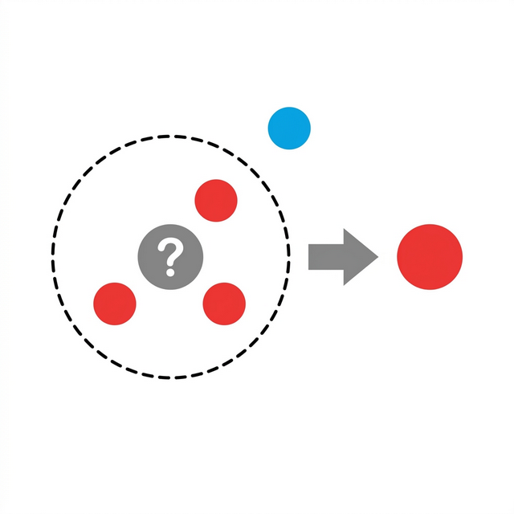

# 💵 Banknote Authentication: Detecting Genuine vs Forged

Welcome! Whether you're a complete beginner to data science or just looking for a clear, intuitive walkthrough of machine learning concepts, this documentation has you covered. 

We will explore how to teach a computer to tell the difference between a **real** and a **fake** banknote (paper money) using an image of the bill. It's like having a digital magnifying glass that automatically detects forgeries!

---

## 🧐 1. What are we trying to do?

Imagine looking at a banknote under a microscope. A real banknote has very specific ink textures, patterns, and security features. A counterfeit (fake) banknote, even a very good one, will look slightly different under intense magnification. 

To help a computer see these differences, researchers took high-resolution photos of real and fake banknotes and mathematically extracted their features using a technique called *Wavelet Transformation*. This technique looks at how textures change across the paper.

We don't need to look at the photos ourselves. The math gives us **four specific numbers (features)** for every banknote. Our goal is to train a Machine Learning model to look at these four numbers and accurately shout "Real!" or "Fake!".

---

## 📊 2. Understanding the Data

We load our data from a popular database repository (UCI Machine Learning Repository).

```python
from ucimlrepo import fetch_ucirepo
import pandas as pd

# Fetch dataset 
banknote_data = fetch_ucirepo(id=267) # Download the Banknote Authentication dataset from the UCI repository
X = banknote_data.data.features # Store the 4 input features (Variance, Skewness, Kurtosis, Entropy) into a variable X
y = banknote_data.data.targets  # Store the answers/labels (0 for forged, 1 for genuine) into a variable y

data = pd.concat([X, y], axis=1) # Combine features and labels into a single table (DataFrame) for easier viewing
```

The dataset has **1,372 samples** (1,372 different banknotes) and **4 features**. Let's break down what those 4 features mean in simple terms:

> [!NOTE]
> ### 1. Variance
> **Variance** tells us how much the pixel colors spread out from the average. Is the area mostly one solid color (low variance) or is it a mix of dark and light spots (high variance)?
> 
> 

> ### 2. Skewness
> **Skewness** measures if the image is unusually dark or unusually light compared to a perfectly balanced image. Think of it as how "lopsided" the colors are.
>
> ### 3. Curtosis (Kurtosis)
> **Kurtosis** measures the extreme values in the image. Does it have really sharp, sudden changes in contrast (like a harsh black line on a white background)?
>
> ### 4. Entropy
> **Entropy** is a measure of randomness or "busyness." A completely blank piece of paper has very low entropy. A piece of paper covered in tiny, unpredictable static dots has very high entropy.

---

## 🔍 3. Exploratory Data Analysis (EDA)

Before building a model, data scientists always look at the data to see if there are missing values and to understand the overall picture.

```python
# Check for missing values
print(data.isnull().sum()) # Ask the table: "Do any columns have missing (null) values?" and add them up

# Look at how many are real vs fake
print(y.value_counts())    # Ask the labels: "Count how many 0s and 1s there are"
```

**Results:**
*   Missing Values: **0** (This is great! It means our data is perfectly clean).
*   Forgeries (`0`): **762**
*   Genuine (`1`): **610**

Our data is relatively balanced. We aren't trying to find a needle in a haystack; we have plenty of examples of both real and fake bills to teach the computer.

---

## 🤖 4. The Machine Learning Models!

We are going to use two popular, beginner-friendly models: **Logistic Regression** and **K-Nearest Neighbors (KNN)**.

### Splitting the Data
First, we separate our 1,372 banknotes into two piles:
*   **Training Set (80%)**: The study guide. The computer uses this to learn the patterns.
*   **Testing Set (20%)**: The final exam. The computer uses this to prove it actually learned how to identify real vs fake bills without memorizing the answers.

```python
from sklearn.model_selection import train_test_split

X_train, X_test, y_train, y_test = train_test_split(
    X, y, test_size=0.2, random_state=42, stratify=y
)
# train_test_split(): A helpful tool that magically divides our data.
# test_size=0.2: Set aside 20% of the data for the final exam.
# random_state=42: A "seed" to make sure the random shuffle is exactly the same every time we run the code.
# stratify=y: Make sure the 80/20 split keeps the same proportion of real/fake bills in both sets so it's a fair test.
```

### Feature Scaling
Because our 4 features are measured on different mathematical scales, we use a `StandardScaler()` to shrink or stretch them so they are all on a level playing field. Otherwise, a feature with a big number range might unfairly bully a feature with a small number range.

---

### Model 1: Logistic Regression 📉

Despite having "regression" in the name, **Logistic Regression** is actually a classifier (it sorts things into categories). 

It tries to draw a single, mathematically straight line between the "Real" bills and the "Fake" bills. If a new bill falls on one side of the line, it's real. If it falls on the other, it's fake.



```python
from sklearn.linear_model import LogisticRegression

# Create the model
log_reg = LogisticRegression() # Initialize our empty math model

# Train it on the study guide!
log_reg.fit(X_train_scaled, y_train['class']) 
# .fit() is where the magic happens! We hand the model the training features (X) and answers (y). It figures out how to draw the line.

# Make predictions on the final exam
y_pred_log = log_reg.predict(X_test_scaled) 
# .predict() asks the model to look at the exam questions (X_test_scaled) and guess the answers (y_pred_log).
```

---

### Model 2: K-Nearest Neighbors (KNN) 🏘️

KNN is incredibly intuitive. Imagine a new, mystery banknote is dropped onto a map with all the other known banknotes. KNN looks at the "K" closest neighbors around it. If we set $K=3$, and the 3 closest known bills on the map are all "Real", KNN guesses the mystery bill is also "Real".

*You are the company you keep!*



```python
from sklearn.neighbors import KNeighborsClassifier

# Create the model (look at the 5 closest neighbors)
knn = KNeighborsClassifier(n_neighbors=5) # Initialize the model and set K=5

# Train it on the study guide!
knn.fit(X_train_scaled, y_train['class']) 
# Just like above, .fit() plots all the training data onto the 'map'.

# Make predictions on the final exam
y_pred_knn = knn.predict(X_test_scaled) 
# The model drops the testing data onto the map, looks at the 5 closest neighbors for each one, and makes a guess!
```

---

## 🏆 5. Evaluating the Results (The Final Exam Grades)

How well did our models do? We use two main tools to find out: the **Confusion Matrix** and **Accuracy**.

### The Confusion Matrix
A confusion matrix is exactly what it sounds like: a table that shows us where the computer got confused! It breaks down the guesses into four categories:
1.  **True Positives:** It said it was a Real bill, and it actually was. (Yay!)
2.  **True Negatives:** It said it was a Fake bill, and it actually was. (Yay!)
3.  **False Positives:** It said it was a Real bill, but it was actually a fake. (Uh oh, bad for the bank).
4.  **False Negatives:** It said it was a Fake bill, but it was actually real. (Annoying for the customer).

### Results Code:
```python
from sklearn.metrics import classification_report, accuracy_score

print("Logistic Regression Accuracy:", accuracy_score(y_test, y_pred_log)) 
# accuracy_score compares the real exam answers (y_test) to the predicted answers (y_pred_log) and gives a percentage.

print("KNN Accuracy:", accuracy_score(y_test, y_pred_knn))
# Same as above, but for the KNN predictions.
```

### The Tally:
*   **Logistic Regression Accuracy:** **~99%**
*   **KNN Accuracy:** **~100%** (Perfect or near-perfect on the test set!)

> [!TIP]
> Both models performed wonderfully, but **KNN slightly outperformed Logistic Regression**. This suggests that finding real vs fake bills isn't just about drawing a single straight line through the data (which is what Logistic Regression does). Instead, fake bills cluster together in specific "neighborhoods" mathematically, making KNN the perfect tool for the job.

---

## 🎉 Conclusion

By looking at just 4 statistical properties (Variance, Skewness, Kurtosis, and Entropy) of a banknote's texture, we were able to train Machine Learning models to accurately identify forgeries with up to **100% accuracy**. 

You've now seen how Data Science goes from raw mathematical numbers into real-world fraud detection!
